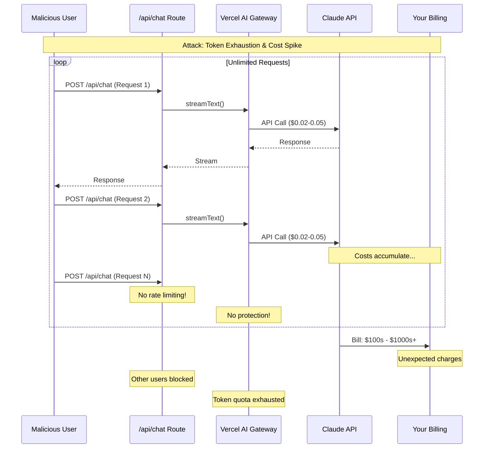
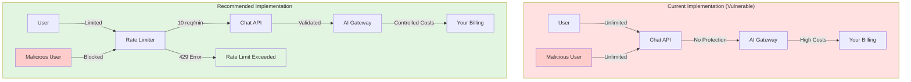
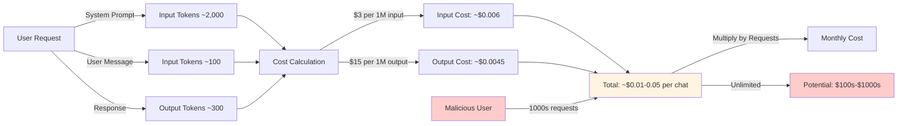

# Chatbot Operations Guide

This document covers how the chatbot works in local development and production, security considerations, cost management, and operational best practices.

## Table of Contents

- [Local Development](#local-development)
- [Production Deployment](#production-deployment)
- [Authentication](#authentication)
- [Security & Abuse Prevention](#security--abuse-prevention)
- [Cost Management](#cost-management)
- [Monitoring & Troubleshooting](#monitoring--troubleshooting)
- [Rate Limiting Implementation](#rate-limiting-implementation)

---

## Local Development

### Setup

1. **Install dependencies:**

   ```bash
   pnpm install
   ```

2. **Link project to Vercel (one-time setup):**

   ```bash
   # Link project to Vercel (if not already linked)
   vc link

   # Make sure you're logged in
   vc whoami
   ```

   Once linked, the Vercel AI SDK automatically gets the OIDC token from your Vercel account. No `.env.local` file needed!

3. **Start development server:**

   ```bash
   pnpm dev
   ```

   That's it! The chatbot will work automatically. The SDK handles authentication behind the scenes when your project is linked to Vercel.

### How It Works Locally

- **Runtime**: Node.js
- **Authentication**: Automatic! When your project is linked to Vercel (`vc link`) and you're logged into Vercel CLI, the SDK automatically gets the OIDC token. No `.env.local` file needed.
- **Model**: Anthropic Claude 3.5 Sonnet via Vercel AI Gateway
- **System Prompt**: Built from `content/profile.ts`, `content/writing.ts`, and `content/life.ts`

**How it works**: The Vercel AI SDK detects that your project is linked to Vercel and automatically retrieves the OIDC token from your Vercel account. This happens transparently - you just run `pnpm dev` and it works!

### Troubleshooting Local Issues

**Problem**: "AI Gateway authentication failed: Invalid OIDC token"

**Solutions**:

1. Make sure project is linked: `vc link` (check if `.vercel/project.json` exists)
2. Make sure you're logged in: `vc whoami` (should show your username)
3. If still not working, try refreshing: `vc env pull` (this will create `.env.local` with the token as fallback)
4. Restart your dev server: `pnpm dev`

**Problem**: Project not linked

**Solutions**:

1. Run `vc link` to link your project to Vercel
2. Make sure you're logged in: `vc whoami`
3. Restart dev server: `pnpm dev`

---

## Production Deployment

### How It Works in Production

- **Runtime**: Node.js (works reliably in production)
- **Authentication**: Vercel automatically injects `VERCEL_OIDC_TOKEN` - no manual setup needed
- **Model**: Anthropic Claude 3.5 Sonnet via Vercel AI Gateway
- **Deployment**: Automatic via Git push to main branch

### Deployment Steps

1. **Push to GitHub:**

   ```bash
   git push origin main
   ```

2. **Vercel automatically:**
   - Builds the Next.js app
   - Injects `VERCEL_OIDC_TOKEN` into the environment
   - Deploys to production

3. **No manual configuration needed** - authentication is handled automatically

### Production Environment Variables

Vercel automatically provides:

- `VERCEL_OIDC_TOKEN` - Automatically injected, no action needed

**Do NOT** add `ANTHROPIC_API_KEY` to production environment variables unless you want to override the OIDC token (not recommended).

---

## Authentication

### How Authentication Works

**Local Development:**

- When project is linked to Vercel (`vc link`) and you're logged into Vercel CLI, the SDK automatically gets the OIDC token
- No `.env.local` file needed - authentication is handled automatically
- Just run `pnpm dev` and it works!

**Production:**

- Vercel automatically injects `VERCEL_OIDC_TOKEN` into the environment
- No manual configuration needed - authentication is handled automatically

### Token Management

**OIDC Token:**

- Automatically managed by Vercel (both locally and in production)
- Expires every 12 hours, but SDK handles refresh automatically when project is linked
- If you need to manually refresh: `vc env pull` (creates `.env.local` as fallback)

---

## Security & Abuse Prevention

### Current Risks

⚠️ **Important**: The chatbot currently has **no rate limiting** or usage quotas. A malicious user could:

- Make unlimited requests
- Exhaust your token quota
- Incur unexpected costs
- Degrade service for other users

### Attack Scenario Diagram



### Current vs Protected Architecture



### Recommended Protections

#### 1. Rate Limiting (High Priority)

Implement rate limiting to prevent abuse:

#### Option A: Vercel Edge Config + Middleware

- Use Vercel's Edge Config for rate limiting
- Implement IP-based rate limiting
- Example: 10 requests per minute per IP

#### Option B: Upstash Redis (Recommended)

- Serverless Redis for rate limiting
- More flexible than Edge Config
- Better for complex rate limiting rules

#### Option C: Vercel Web Application Firewall (WAF)

- Built-in protection at the edge
- Configure rate limiting rules in Vercel dashboard
- Blocks malicious traffic before it reaches your API

#### 2. Usage Quotas

Consider implementing per-user or per-session quotas:

- Limit number of messages per session
- Limit total tokens per user per day
- Implement "rate limit exceeded" error messages

#### 3. Input Validation

Already implemented:

- ✅ Message array validation
- ✅ Request format validation

Consider adding:

- Maximum message length limits
- Content filtering (prevent prompt injection attempts)
- Request size limits

#### 4. Monitoring & Alerts

Set up alerts for:

- Unusual spike in requests
- High token usage
- Error rate increases
- Cost thresholds

---

## Cost Management

### Cost Flow Diagram



### Understanding Costs

**Claude 3.5 Sonnet Pricing** (via Vercel AI Gateway):

- **Input**: ~$3 per 1M tokens
- **Output**: ~$15 per 1M tokens

**Typical Chat Costs:**

- System prompt: ~2,000 tokens (one-time per request)
- User message: ~50-200 tokens
- Assistant response: ~100-500 tokens
- **Estimated cost per conversation**: $0.01 - $0.05

### Cost Control Strategies

1. **Set Budget Alerts**
   - Configure spending alerts in Vercel dashboard
   - Set monthly budget limits
   - Get notified before exceeding thresholds

2. **Monitor Usage**
   - Check Vercel Analytics for request patterns
   - Review AI Gateway usage metrics
   - Identify unusual spikes

3. **Implement Rate Limiting**
   - Prevents abuse that could exhaust tokens
   - Limits per-user usage
   - Protects against cost spikes

4. **Optimize System Prompt**
   - Current system prompt is ~2,000 tokens
   - Consider reducing if possible (but maintain quality)
   - Every token counts for input costs

5. **Consider Usage-Based Pricing**
   - If chatbot becomes popular, consider:
     - Requiring authentication
     - Implementing usage tiers
     - Charging for premium features

### Cost Estimation

**Conservative Estimate** (with rate limiting):

- 100 conversations/day × $0.02 avg = $2/day = ~$60/month
- 1,000 conversations/day × $0.02 avg = $20/day = ~$600/month

**Without Rate Limiting** (risk):

- Single malicious user could generate thousands of requests
- Potential cost: $100s - $1000s+ if not protected

---

## Monitoring & Troubleshooting

### Key Metrics to Monitor

1. **Request Volume**
   - Total requests per day/hour
   - Requests per IP address
   - Peak usage times

2. **Error Rates**
   - 401 (authentication) errors
   - 500 (server) errors
   - Rate limit exceeded errors

3. **Response Times**
   - Average response time
   - P95/P99 latency
   - Streaming performance

4. **Token Usage**
   - Total tokens consumed
   - Average tokens per request
   - Cost per request

### Monitoring Tools

**Vercel Dashboard:**

- Function logs
- Analytics dashboard
- Error tracking

**Custom Logging:**

- Add structured logging to API route
- Log request metadata (IP, user agent, etc.)
- Track token usage per request

**Example Logging:**

```typescript
console.log(
  JSON.stringify({
    type: "chat_request",
    ip: req.headers.get("x-forwarded-for"),
    timestamp: new Date().toISOString(),
    messageCount: messages.length,
  }),
);
```

### Common Issues

**Issue**: High error rate

**Debugging**:

1. Check Vercel function logs
2. Verify authentication (OIDC token valid)
3. Check for rate limiting issues
4. Review error messages in logs

**Issue**: Slow responses

**Debugging**:

1. Check Claude API status
2. Review system prompt size (affects latency)
3. Check Vercel function cold starts
4. Monitor streaming performance

**Issue**: Unexpected costs

**Debugging**:

1. Review Vercel Analytics
2. Check for abuse patterns (single IP, high volume)
3. Review token usage metrics
4. Identify if specific queries are expensive

---

## Rate Limiting Implementation

### Recommended: Upstash Redis Rate Limiting

**Install dependencies:**

```bash
pnpm add @upstash/redis @upstash/ratelimit
```

**Create rate limiter:**

```typescript
// lib/rate-limit.ts
import { Ratelimit } from "@upstash/ratelimit";
import { Redis } from "@upstash/redis";

const redis = new Redis({
  url: process.env.UPSTASH_REDIS_REST_URL!,
  token: process.env.UPSTASH_REDIS_REST_TOKEN!,
});

export const rateLimiter = new Ratelimit({
  redis,
  limiter: Ratelimit.slidingWindow(10, "1 m"), // 10 requests per minute
  analytics: true,
});
```

**Use in API route:**

```typescript
// app/api/chat/route.ts
import { rateLimiter } from "@/lib/rate-limit";

export async function POST(req: Request) {
  // Get client IP
  const ip = req.headers.get("x-forwarded-for") || "unknown";

  // Check rate limit
  const { success, limit, remaining, reset } = await rateLimiter.limit(ip);

  if (!success) {
    return new Response(
      JSON.stringify({
        error: "Rate limit exceeded. Please try again later.",
        reset: new Date(reset).toISOString(),
      }),
      {
        status: 429,
        headers: {
          "Content-Type": "application/json",
          "X-RateLimit-Limit": limit.toString(),
          "X-RateLimit-Remaining": remaining.toString(),
          "X-RateLimit-Reset": new Date(reset).toISOString(),
        },
      },
    );
  }

  // Continue with chat logic...
}
```

### Alternative: Vercel Edge Config Rate Limiting

Simpler but less flexible. See Vercel docs for implementation.

---

## Best Practices Summary

✅ **Do:**

- Link your project to Vercel (`vc link`) for automatic authentication
- Use `pnpm dev` for local development (works automatically when linked)
- Implement rate limiting before public launch
- Monitor usage and costs regularly
- Set up budget alerts
- Log important events for debugging

❌ **Don't:**

- Commit API keys or tokens to Git (not needed when using automatic auth)
- Deploy without rate limiting
- Ignore cost monitoring
- Use Edge Runtime with `next dev` (use Node.js runtime)
- Hardcode authentication credentials

---

## Next Steps

1. **Immediate**: Implement rate limiting before public launch
2. **Short-term**: Set up monitoring and alerts
3. **Medium-term**: Add usage analytics dashboard
4. **Long-term**: Consider authentication for premium features

---

## References

- [Vercel AI Gateway Docs](https://vercel.com/docs/ai-gateway)
- [Vercel AI SDK Docs](https://sdk.vercel.ai/docs)
- [Anthropic Pricing](https://www.anthropic.com/pricing)
- [Upstash Rate Limiting](https://upstash.com/docs/redis/features/ratelimit)
