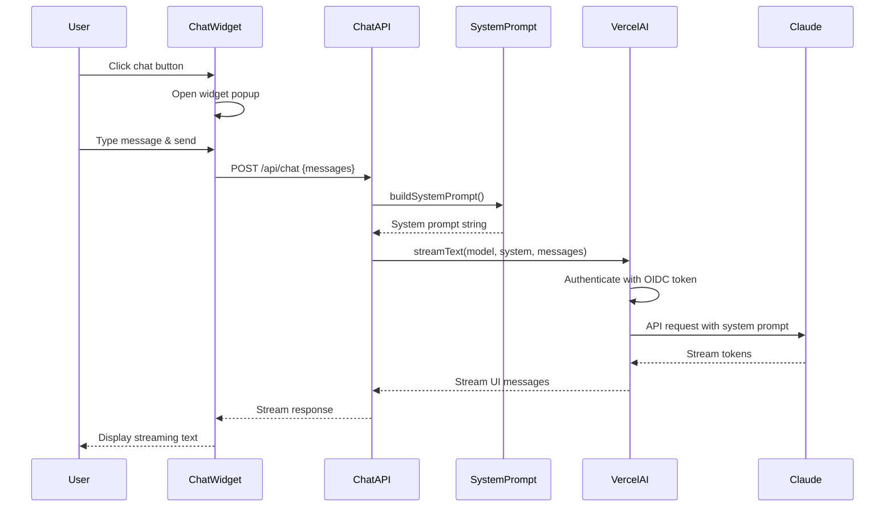

# Chatbot Progress / PR Plan

This file tracks the implementation of the chatbot feature, broken down into small, focused PRs.

📖 **See also**: [Chatbot Operations Guide](./docs/chatbot-operations.md) for local/production setup, security, cost management, and monitoring.

## Status Summary

**MVP Status**: ✅ **COMPLETED** (PRs 1-4)

The chatbot MVP is fully implemented and deployed:

- ✅ System prompt builder with Harel's content
- ✅ Chat API route with streaming support
- ✅ Chat widget UI (floating button, modal dialog)
- ✅ Markdown rendering for assistant messages
- ✅ Input validation and character limits
- ✅ Comprehensive test coverage (14 unit + 2 integration tests)
- ✅ Accessible design (keyboard navigation, ARIA labels)
- ✅ Dark mode support
- ✅ Integrated site-wide via `app/layout.tsx`

**Next Steps**:

- ⏳ Rate limiting and usage monitoring (PR 5)
- ⏳ RAG enhancement for source citations (Future Phase)

## Goal

A chatbot that answers questions about Harel's content (talks, writing, projects) using a system prompt with static content. This MVP approach provides a fast path to shipping, with RAG (Retrieval-Augmented Generation) planned for a future phase to enable more accurate answers with source citations.

## Architecture

- **Stack**: Next.js (App Router) on Vercel
- **LLM**: Anthropic Claude 3.5 Sonnet (via Vercel AI Gateway - uses Vercel account OIDC token, no API key needed)
- **SDK**: Vercel AI SDK with AI Gateway for streaming chat
- **System Prompt**: Static content compiled from `content/profile.ts`, `content/writing.ts`, and `content/life.ts`

### Architecture Diagram

```mermaid
graph TB
    User[User Browser] -->|Click Chat Button| ChatWidget[ChatWidget Component]
    ChatWidget -->|User Message| ChatAPI[/api/chat Route]
    ChatAPI -->|Build System Prompt| SystemPrompt[buildSystemPrompt]
    SystemPrompt -->|Read Content| Profile[content/profile.ts]
    SystemPrompt -->|Read Content| Writing[content/writing.ts]
    SystemPrompt -->|Read Content| Life[content/life.ts]
    ChatAPI -->|Stream Request| VercelAI[Vercel AI Gateway]
    VercelAI -->|OIDC Token Auth| Anthropic[Anthropic Claude 3.5 Sonnet]
    Anthropic -->|Stream Response| VercelAI
    VercelAI -->|Stream Text| ChatAPI
    ChatAPI -->|Stream UI Messages| ChatWidget
    ChatWidget -->|Display Messages| User

    style ChatWidget fill:#e1f5e1
    style ChatAPI fill:#e1f5e1
    style VercelAI fill:#fff4e1
    style Anthropic fill:#ffe1e1
```

### Current Implementation Flow



### Security Vulnerabilities (Current State)

```mermaid
graph LR
    Attacker[Malicious User] -->|Unlimited Requests| ChatAPI[/api/chat Route]
    ChatAPI -->|No Rate Limiting| VercelAI[Vercel AI Gateway]
    VercelAI -->|Consumes Tokens| Claude[Claude API]
    Claude -->|High Costs| Billing[Your Billing Account]

    Attacker -.->|Attack Vector| TokenExhaustion[Token Quota Exhausted]
    Attacker -.->|Attack Vector| CostSpike[Unexpected Costs $100s-$1000s]
    Attacker -.->|Attack Vector| ServiceDegradation[Other Users Blocked]

    style Attacker fill:#ffcccc
    style TokenExhaustion fill:#ffcccc
    style CostSpike fill:#ffcccc
    style ServiceDegradation fill:#ffcccc
    style ChatAPI fill:#ffe1e1
```

### Recommended Security Architecture

```mermaid
graph TB
    User[User Browser] -->|Request| RateLimiter[Rate Limiter]
    RateLimiter -->|Check IP/User| Redis[(Upstash Redis)]
    RateLimiter -->|Rate Limit OK?| Decision{Allowed?}
    Decision -->|No| Blocked[429 Rate Limit Exceeded]
    Decision -->|Yes| ChatAPI[/api/chat Route]
    ChatAPI -->|Validate Input| Validator[Input Validator]
    Validator -->|Valid?| Decision2{Valid?}
    Decision2 -->|No| Error[400 Bad Request]
    Decision2 -->|Yes| VercelAI[Vercel AI Gateway]
    VercelAI -->|Monitor Usage| Monitoring[Usage Monitoring]
    Monitoring -->|Alert Threshold| Alerts[Cost Alerts]

    style RateLimiter fill:#e1f5e1
    style Validator fill:#e1f5e1
    style Monitoring fill:#e1f5e1
    style Blocked fill:#ffcccc
    style Error fill:#ffcccc
```

## Implementation PRs

### ✅ PR 1: Project Setup & Dependencies

**Status**: ✅ **COMPLETED**

**Goal**: Verify dependencies and set up project structure

**Changes**:

- ✅ Verified `ai` SDK and `@ai-sdk/react` are installed (`package.json`)
- ✅ Added `react-markdown` for markdown rendering
- ✅ Created folder structure: `lib/` exists
- ✅ Note: No external API keys needed - Vercel AI Gateway uses OIDC token from Vercel account
- ✅ For local dev: use `vc dev` or `vc env pull` to get OIDC token
- ✅ Added `dev:vercel` script for local development with Vercel CLI

**Verification**:

- ✅ `pnpm install` succeeds
- ✅ No TypeScript errors
- ✅ Folder structure exists

---

### ✅ PR 2: System Prompt Builder

**Status**: ✅ **COMPLETED**

**Goal**: Create system prompt with Harel's content

**Changes**:

- ✅ Created `lib/system-prompt.ts`
- ✅ Function: `buildSystemPrompt(): string`
- ✅ Includes content from:
  - `content/profile.ts`: bio, highlights, experience, skills, education
  - `content/writing.ts`: writing series and featured articles
  - `content/life.ts`: hobbies/interests, family
- ✅ Formatted as readable text with clear sections
- ✅ Includes instructions: answer questions about Harel, cite sources when possible (e.g., mention specific articles or experiences), be helpful and concise
- ✅ Structure: Introduction → About → Experience → Skills → Education → Writing → Interests → Links
- ✅ Uses array-based approach (`sections.push()`) for cleaner code

**Verification**:

- ✅ System prompt builds correctly
- ✅ All content sections included
- ✅ Text is readable and well-formatted
- ✅ Instructions are clear

---

### ✅ PR 3: Chat API Route

**Status**: ✅ **COMPLETED**

**Goal**: Create chat API endpoint with system prompt

**Changes**:

- ✅ Created `app/api/chat/route.ts`
- ✅ Uses Vercel AI SDK `streamText` with Vercel AI Gateway
- ✅ Model: `'anthropic/claude-3.5-sonnet'` (no API key needed - uses Vercel OIDC token)
- ✅ Flow:
  1. Receive user message
  2. Validate messages array and limit payload size (`MAX_MESSAGES_PER_REQUEST = 10`)
  3. Load system prompt from `buildSystemPrompt()`
  4. Convert messages using `convertToCoreMessages()`
  5. Stream response using `streamText` with system prompt
  6. Return `toUIMessageStreamResponse()` for DefaultChatTransport compatibility
- ✅ Error handling with helpful auth error messages
- ✅ Input validation: message count limit, array validation
- ✅ Runtime: `nodejs` for proper `.env.local` reading
- ✅ Note: Authentication handled automatically by Vercel AI Gateway when deployed

**Verification**:

- ✅ API endpoint responds
- ✅ Streaming works
- ✅ Responses are relevant to Harel's content
- ✅ Handles errors gracefully
- ✅ Input validation prevents abuse

---

### ✅ PR 4: Chat UI & Widget

**Status**: ✅ **COMPLETED**

**Goal**: Build chat interface and integrate into site

**Changes**:

- ✅ Created `app/components/Chat.tsx`
- ✅ Uses Vercel AI SDK `useChat` hook with `DefaultChatTransport`
- ✅ Features:
  - ✅ Message list (user/assistant) with proper styling
  - ✅ Streaming text display
  - ✅ Loading states with animated dots
  - ✅ Error handling with user-friendly messages
  - ✅ Input field with character limit (100 chars) and visual feedback
  - ✅ Character counter with color-coded warnings (70/80/90 thresholds)
  - ✅ Send button with proper disabled states
  - ✅ Empty state message
  - ✅ Auto-scroll to latest message
  - ✅ Callback ref support for focus management
- ✅ Created `app/components/MarkdownRenderer.tsx` for assistant message formatting
  - ✅ Supports headings, paragraphs, lists, code blocks, links, bold, italic, blockquotes
  - ✅ Dark mode support
  - ✅ Extracted styles to constants for maintainability
- ✅ Created `app/components/ChatWidget.tsx` (floating widget, not separate page)
  - ✅ Floating button in bottom-right corner
  - ✅ Modal dialog with header and close button
  - ✅ Keyboard support (Escape to close)
  - ✅ Focus management (auto-focus input when opened)
  - ✅ Accessible (ARIA labels, roles, keyboard navigation)
- ✅ Integrated into `app/layout.tsx` (available site-wide)
- ✅ Matches existing design system (Tailwind, dark mode)
- ✅ Responsive design (mobile-friendly widget sizing)
- ✅ Added tests: `tests/unit/Chat.test.tsx` and `tests/unit/ChatWidget.test.tsx`
  - ✅ Tests user-observable behavior
  - ✅ Uses semantic queries (no `data-testid` except where necessary)
  - ✅ Tests markdown rendering
- ✅ Updated `progress.md` to mark chatbot as "Now" instead of "Coming soon"

**Verification**:

- ✅ Chat UI renders correctly
- ✅ Messages display properly
- ✅ Streaming works smoothly
- ✅ Responsive design
- ✅ Dark mode works
- ✅ Widget accessible site-wide (bottom-right corner)
- ✅ Full flow works: question → answer
- ✅ Markdown formatting renders correctly
- ✅ Integration with site design
- ✅ All tests pass (14 unit tests)

---

## Future Phase: RAG Enhancement

The following PRs will be implemented in a future phase to add RAG capabilities, enabling more accurate answers with source citations and the ability to answer questions about specific blog posts.

### RAG PR 1: Database Connection & Types

**Goal**: Set up database connection utilities and TypeScript types

**Changes**:

- Create `lib/db.ts` with Postgres connection using `@vercel/postgres`
- Implement type definitions in `types/embeddings.ts`:
  - `EmbeddingRow` (database row type)
  - `ChunkMetadata` (metadata structure)
  - `ContentChunk` (processed chunk type)
- Add helper functions: `getDb()`, basic query utilities
- Add environment variable: `POSTGRES_URL`
- Note: Vercel AI Gateway authentication handled automatically via OIDC token (no API keys needed)

**Verification**:

- Database connection works (test query)
- Types compile without errors
- Can read from database

---

### RAG PR 2: Database Schema Migration

**Goal**: Create embeddings table with pgvector support

**Changes**:

- Create `scripts/migrations/001_create_embeddings.sql`
- SQL to enable pgvector extension
- Create `embeddings` table:
  - `id` (uuid, primary key)
  - `content` (text)
  - `embedding` (vector) - dimensions match Cohere embed-v4.0 (check model docs for exact dimensions)
  - `metadata` (jsonb)
  - `created_at` (timestamp)
- Add index on embedding column for vector search
- Create migration runner script (optional, or manual run)

**Verification**:

- Migration runs successfully
- Table exists with correct schema
- Can insert test row with vector

---

### RAG PR 3: Markdown Content Processor

**Goal**: Read and chunk markdown blog posts

**Changes**:

- Create `lib/process-markdown.ts`
- Function to read markdown files from `../ai-driven/blog-posts/*.md`
- Parse frontmatter (title, published date, URL, tags) using `gray-matter`
- Split into semantic chunks (~500-800 tokens, preserve section boundaries)
- Extract metadata: file path, section title, URL, published date
- Return array of `ContentChunk` objects

**Verification**:

- Can process all markdown files
- Chunks are reasonable size
- Metadata is preserved correctly
- Test with sample file

---

### RAG PR 4: TypeScript Content Processor

**Goal**: Process TypeScript content files (profile, writing, life)

**Changes**:

- Create `lib/process-ts-content.ts`
- Process `content/profile.ts`:
  - Convert bio, highlights, experience, skills to readable text
  - Preserve context (e.g., "Experience at Verbit.ai: ...")
- Process `content/writing.ts`: convert to readable format
- Process `content/life.ts`: convert hobbies/interests to text
- Chunk appropriately (smaller chunks for structured data)
- Extract metadata: content type, field name

**Verification**:

- All TypeScript content files processed
- Text is readable and contextual
- Metadata correctly identifies source

---

### RAG PR 5: Embedding Generation Utilities

**Goal**: Generate embeddings using Vercel AI Gateway (no external API keys)

**Changes**:

- Create `lib/embeddings.ts`
- Function: `generateEmbedding(text: string): Promise<number[]>`
- Use Vercel AI SDK `embed` function with model `'cohere/embed-v4.0'`
- No API keys needed - uses Vercel account OIDC token automatically
- Batch processing function for multiple texts
- Error handling and retry logic
- Rate limiting considerations
- Note: Embedding dimensions determined by Cohere embed-v4.0 model

**Verification**:

- Can generate embedding for sample text
- Embedding dimensions match database schema
- Handles errors gracefully
- Test with batch of texts
- Works without external API keys (uses Vercel OIDC token)

---

### RAG PR 6: Content Indexing Script

**Goal**: Script to process all content and store embeddings in database

**Changes**:

- Create `scripts/index-content.ts`
- Orchestrate: read content → chunk → embed → store
- Use markdown and TS content processors
- Generate embeddings in batches
- Store in database with metadata
- Idempotent (can re-run safely, skip existing)
- Progress logging

**Verification**:

- Script runs end-to-end
- All content indexed in database
- Can re-run without duplicates
- Check database has expected rows

---

### RAG PR 7: Vector Search Utilities

**Goal**: Implement vector similarity search using pgvector

**Changes**:

- Create `lib/vector-search.ts`
- Function: `searchSimilarChunks(queryEmbedding: number[], limit: number, threshold?: number)`
- SQL query using pgvector cosine similarity: `1 - (embedding <=> query_embedding::vector)`
- Return chunks with metadata and similarity scores
- Handle edge cases (no results, low similarity)

**Verification**:

- Can search with test embedding
- Returns results ordered by similarity
- Similarity scores are reasonable (0-1 range)
- Handles empty results

---

### RAG PR 8: Context Builder for RAG

**Goal**: Format retrieved chunks for LLM prompt with citations

**Changes**:

- Create `lib/build-context.ts`
- Function: `buildContext(chunks: EmbeddingRow[]): string`
- Format chunks with source citations
- Include metadata (file name, URL if available, section)
- Limit total context tokens (~2000-3000)
- Format: "Source: [title/URL]\n\n[content]\n\n---"

**Verification**:

- Context is well-formatted
- Citations are clear
- Token count is within limits
- Test with various chunk combinations

---

### RAG PR 9: Update Chat API Route for RAG

**Goal**: Update chat API to use RAG instead of system prompt

**Changes**:

- Update `app/api/chat/route.ts`
- Replace system prompt approach with RAG flow:
  1. Receive user message
  2. Generate query embedding using `embed({ model: 'cohere/embed-v4.0', value: query })`
  3. Search for similar chunks (top 3-5)
  4. Build context with citations
  5. Stream response with source references
- System prompt: instruct LLM to cite sources and only answer from provided context
- Error handling

**Verification**:

- API endpoint responds
- Streaming works
- Responses cite sources accurately
- Handles errors gracefully
- Test with various questions

---

## Testing Strategy

**Status**: ✅ **COMPLETED** for MVP PRs

**Implemented**:

- ✅ Unit tests for `Chat` component (`tests/unit/Chat.test.tsx`)
  - Empty state, input/send button, form submission, message display, error handling, loading states, markdown rendering
- ✅ Unit tests for `ChatWidget` component (`tests/unit/ChatWidget.test.tsx`)
  - Widget toggle, close button, Escape key handling
- ✅ Integration tests for pages (`tests/integration/`)
- ✅ Test setup with proper mocks (`tests/setup.tsx`)
  - Mocked `next/link`, `next/image`, `scrollIntoView`
- ✅ All tests use semantic queries (RTL best practices)
- ✅ Tests focus on user-observable behavior

**Verification**:

- ✅ All tests pass (14 unit tests + 2 integration tests)
- ✅ TypeScript compilation passes (`pnpm typecheck`)
- ✅ No linting errors (`pnpm lint`)
- ✅ Code formatting passes (`pnpm format:check`)

## Future Enhancements (Out of Scope)

- Conversation history (privacy-first storage)
- Reranking for better retrieval (Cohere Rerank)
- Fine-tuned chunking strategies
- Analytics on queries
- Admin panel for re-indexing

## Decisions

- **LLM**: Anthropic Claude 3.5 Sonnet via Vercel AI Gateway (no external API keys needed - uses Vercel account OIDC token)
- **SDK**: Vercel AI SDK with AI Gateway (standard Vercel approach, supports streaming, no API key management)
- **Authentication**: Vercel AI Gateway handles auth automatically via OIDC token when deployed; use `vc dev` for local development
- **Approach**: System prompt with static content (MVP) - simpler, faster to ship, good enough for initial use
- **Streaming**: Yes, for better UX
- **Conversation History**: No (stateless for MVP)
- **Future Enhancement**: RAG will be added in a future phase to enable source citations and more accurate answers about specific content

## Security (MVP Constraints)

**Current State**: Basic input validation implemented. Rate limiting and usage monitoring planned for follow-up.  
**Risk**: Until rate limiting is implemented, the chat API is vulnerable to abuse leading to unexpected costs. Input validation provides basic protection.

**Security Roadmap**:

- ✅ **PR 3 (Completed)**: Basic input validation
  - ✅ Message count limit (`MAX_MESSAGES_PER_REQUEST = 10`)
  - ✅ Per-message length validation (100 character limit in UI)
  - ✅ Array validation for messages payload
- ⏳ **PR 5 (Planned)**: Rate limiting with Upstash Redis to prevent abuse
- ⏳ **PR 5 (Planned)**: Usage monitoring and cost alerts

**Note**: The security diagrams above (lines 67-108) illustrate the recommended architecture. Rate limiting is a critical mitigation but is deferred to a follow-up PR to enable faster MVP delivery. The current implementation includes basic input validation to reduce token consumption from individual requests.
